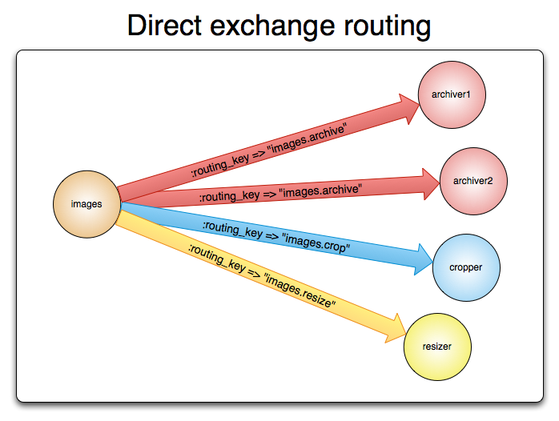
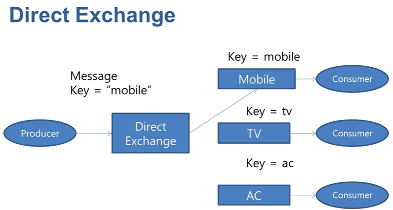
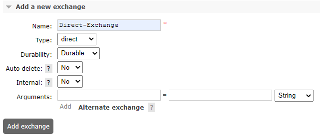
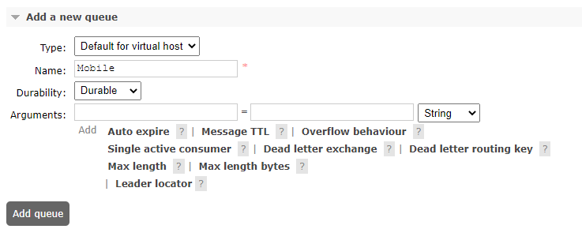
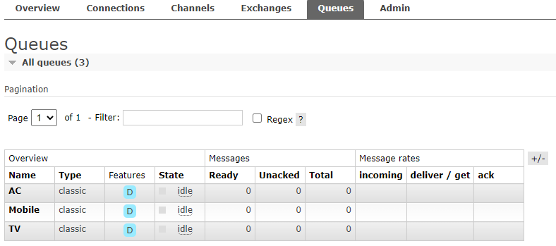
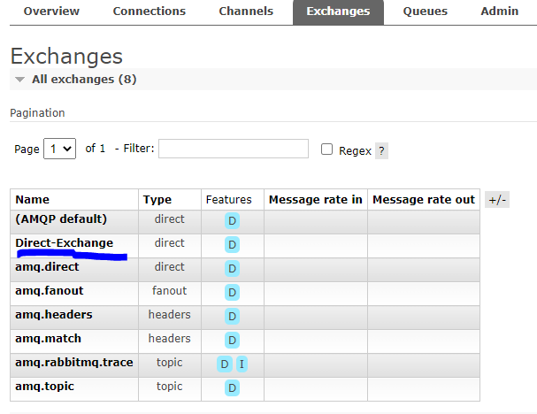
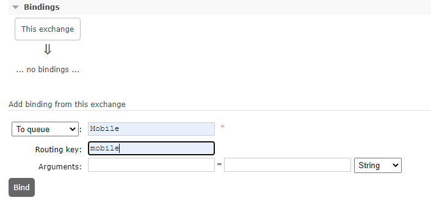
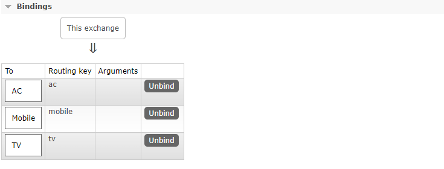

## Direct-exchange
### 정의
* 큐와 익스체인지가 routing key K를 이용해서 바인딩됨.
* 이때 새로운 메시지와 routing key R 이 도착하면 exchange는 K = R일 경우 큐로 라우팅 한다.
* 
* 

### 사례
* 대기열은 라우팅 키 K를 사용하여 교환에 바인딩됩니다.
* 라우팅 키 R이 있는 새 메시지가 직접 교환기에 도착하면 교환기는 K = R인 경우 메시지를 대기열로 라우팅합니다.
* 여러 대기열이 동일한 라우팅 키 K를 사용하여 직접 교환에 바인딩된 경우 교환은 메시지를 K = R인 모든 대기열로 라우팅합니다

### add new exchange
* 
* durability : 브로커가 재시작 될 때 남아 있는지 여부(durable, transient)
* Auto-delete : 마지막 Queue 연결이 해제되면 삭제

### 3개 queue 추가
* Mobile
  * 
* Mobile와 동일한 설정으로 TV, AC Queue를 추가
  * 

### Exchange queue bind
* 생성된 que를 exchange에 연결
  * 
  * 
  * 

### sample code
* Publisher code
```java
public class DirectPublisher {
    public static void main(String[] args) throws Exception {
        ConnectionFactory factory = new ConnectionFactory();
        Connection connection = factory.newConnection();
        Channel channel = connection.createChannel();

        for(int i = 0; i< 3; i++) {
            Person person = new Person(1L, "홍길동");
            channel.basicPublish("Direct-Exchange", "mobile", null, person.toString().getBytes());
            channel.basicPublish("Direct-Exchange", "tv", null, person.toString().getBytes());
            channel.basicPublish("Direct-Exchange", "ac", null, person.toString().getBytes());
            Thread.sleep(300);
        }
        channel.close();
        connection.close();
    }
}
```

* Consumer code
```java
public class Consumer {
    public static void main(String[] args) throws IOException, TimeoutException {
        System.out.println("Consumer start");
        ConnectionFactory factory = new ConnectionFactory();
        Connection connection = factory.newConnection();
        Channel channel = connection.createChannel();

        DeliverCallback deliverCallback = (consumerTag, delivery) -> {
            String message = new String(delivery.getBody());
            System.out.println("Message received=" + message);
        };
      channel.basicConsume("Mobile", true, deliverCallback, consumerTag -> {});
      channel.basicConsume("TV", true, deliverCallback, consumerTag -> {});
      channel.basicConsume("AC", true, deliverCallback, consumerTag -> {});
    }
}
```