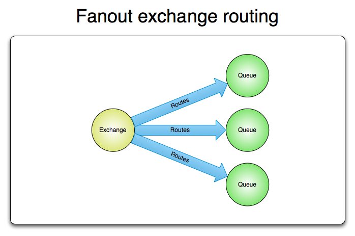
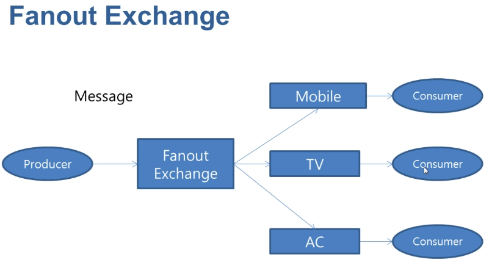
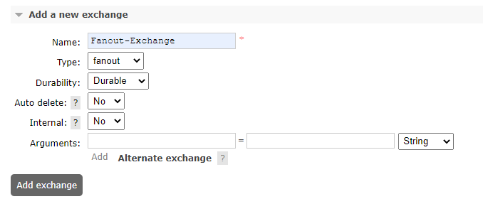
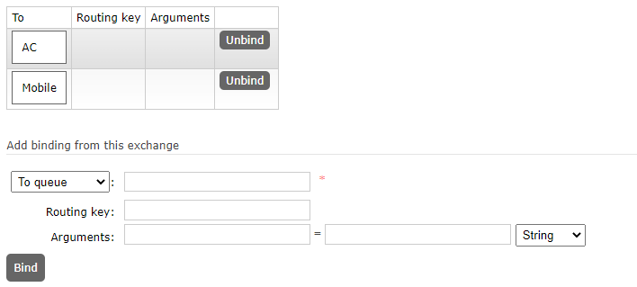

## Fanout-exchange
### 정의
* 팬아웃 교환은 바인딩된 모든 대기열로 메시지를 라우팅하며 라우팅 키는 무시
* N개의 대기열이 팬아웃 교환에 바인딩된 경우 새 메시지가 해당 교환에 게시될 때 메시지 복사본이 모든 N 대기열에 전달
* 메시지의 브로드캐스트 라우팅에 이상적
* 
* 

### 사례
* MMO(Massively Multi-Player Online) 게임에서 순위표 업데이트 또는 기타 글로벌 이벤트에 사용할 수 있습니다.
* 스포츠 뉴스 사이트는 점수 업데이트를 거의 실시간으로 모바일 클라이언트에 배포하기 위해 팬아웃 교환을 사용할 수 있습니다.
* 분산 시스템은 다양한 상태 및 구성 업데이트를 브로드캐스트할 수 있습니다.
* 그룹 채팅은 팬아웃 교환을 사용하여 참가자 간에 메시지를 배포할 수 있습니다(AMQP에는 기본 제공 개념이 없으므로 XMPP가 더 나은 선택일 수 있음).

### add new exchange
* 
* durability : 브로커가 재시작 될 때 남아 있는지 여부(durable, transient)
* Auto-delete : 마지막 Queue 연결이 해제되면 삭제

### Exchange queue bind
* 

### sample code
* Publisher code
```java
public class FanoutPublisher {
  public static void main(String[] args) throws IOException, TimeoutException {
    ConnectionFactory factory = new ConnectionFactory();
    Connection connection = factory.newConnection();
    Channel channel = connection.createChannel();

    String message = "Message for Mobile & AC";
    channel.basicPublish("Fanout-Exchange", "", null, message.getBytes());

    channel.close();
    connection.close();
  }
}
```

* Consumer code
```java
public class Consumer {
  public static void main(String[] args) throws IOException, TimeoutException {
    System.out.println("Consumer start");
    ConnectionFactory factory = new ConnectionFactory();
    Connection connection = factory.newConnection();
    Channel channel = connection.createChannel();

    DeliverCallback deliverCallback = (consumerTag, delivery) -> {
      String message = new String(delivery.getBody());
      System.out.println("Message received=" + message);
    };
    channel.basicConsume("Mobile", true, deliverCallback, consumerTag -> {});
    channel.basicConsume("TV", true, deliverCallback, consumerTag -> {});
    channel.basicConsume("AC", true, deliverCallback, consumerTag -> {});
  }
}
```