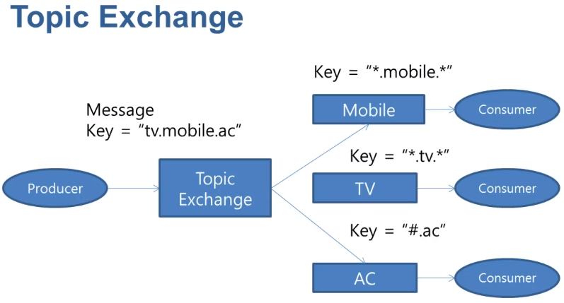
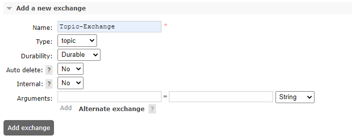
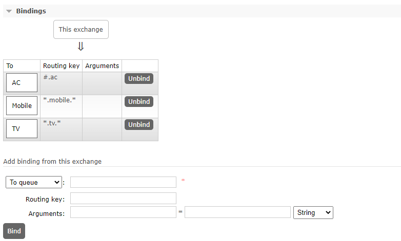

## Topic-exchange
### 정의
* 메시지 라우팅 키와 대기열을 교환에 바인딩하는 데 사용된 패턴 간의 일치를 기반으로 하나 이상의 대기열로 메시지를 라우팅
* 유형은 종종 다양한 게시/구독 패턴 변형을 구현하는 데 사용
* 일반적으로 메시지의 멀티캐스트 라우팅에 사용
* 

### 사례
* 특정 지리적 위치(예: POS)와 관련된 데이터 배포
* 각각 특정 작업 집합을 처리할 수 있는 여러 작업자가 수행하는 백그라운드 작업 처리
* 주가 업데이트(및 기타 재무 데이터 업데이트)
* 분류 또는 태깅이 포함된 뉴스 업데이트(예: 특정 스포츠 또는 팀 전용)
* 클라우드에서 다양한 종류의 서비스 오케스트레이션
* 각 빌더가 하나의 아키텍처 또는 OS만 처리할 수 있는 분산 아키텍처/OS별 소프트웨어 빌드 또는 패키징

### add new exchange
* 
* durability : 브로커가 재시작 될 때 남아 있는지 여부(durable, transient)
* Auto-delete : 마지막 Queue 연결이 해제되면 삭제

### Exchange queue bind
* 
* '*' 정확히 한 단어를 대체.
* '#' 는 0개 이상의 단어를 대체.

### sample code
* Publisher code
```java
public class TopicPublisher {

    public static void main(String[] args) throws IOException, TimeoutException {
        ConnectionFactory factory = new ConnectionFactory();
        Connection connection = factory.newConnection();
        Channel channel = connection.createChannel();

        Person person = new Person(1L, "홍길동 tv.mobile.ac");
        channel.basicPublish("Topic-Exchange", "tv.mobile.ac", null, person.toString().getBytes());

        channel.close();
        connection.close();
    }
}
```

* Consumer code
```java
public class Consumer {
  public static void main(String[] args) throws IOException, TimeoutException {
    System.out.println("Consumer start");
    ConnectionFactory factory = new ConnectionFactory();
    Connection connection = factory.newConnection();
    Channel channel = connection.createChannel();

    DeliverCallback deliverCallback = (consumerTag, delivery) -> {
      String message = new String(delivery.getBody());
      System.out.println("Message received=" + message);
    };
    channel.basicConsume("Mobile", true, deliverCallback, consumerTag -> {});
    channel.basicConsume("TV", true, deliverCallback, consumerTag -> {});
    channel.basicConsume("AC", true, deliverCallback, consumerTag -> {});
  }
}
```