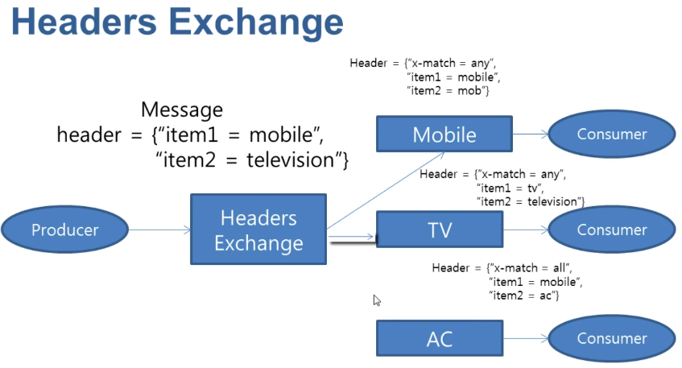
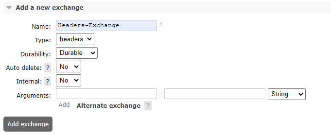
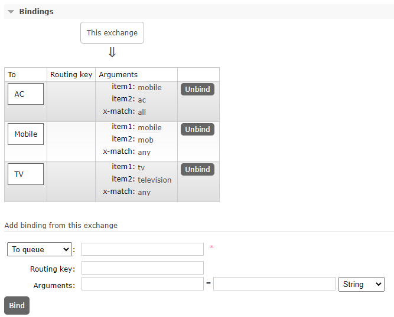

## Headers-exchange
### 정의
* 라우팅 키 속성을 무시
* 유형은 종종 다양한 게시/구독 패턴 변형을 구현하는 데 사용
* 헤더 값이 바인딩 시 지정된 값과 같으면 메시지가 일치하는 것으로 간주
* 둘 이상의 헤더를 사용하여 대기열을 헤더 교환에 바인딩
* "x-match" 인수가 "any"로 설정된 경우 하나의 일치하는 헤더 값이면 충분하지만, "x-match"를 "all"로 설정하면 모든 값이 일치해야 함
* 

### 사례

### add new exchange
* 
* durability : 브로커가 재시작 될 때 남아 있는지 여부(durable, transient)
* Auto-delete : 마지막 Queue 연결이 해제되면 삭제

### Exchange queue bind
* 

### sample code
* Publisher code
```java
public class HeadersPublisher {
    public static void main(String[] args) throws IOException, TimeoutException {
        ConnectionFactory factory = new ConnectionFactory();
        Connection connection = factory.newConnection();
        Channel channel = connection.createChannel();

        Person person = null;
        Map<String, Object> headersMap = null;

        //match any
        person = new Person(1L, "홍길동 to Mobile-any, TV-any, item1:mobile, item2:television");
        headersMap = new HashMap<String, Object>();
        headersMap.put("item1", "mobile");
        headersMap.put("item2", "television");
        publish(channel, person, headersMap);

        //match any, all
        person = new Person(2L, "홍길동 to AC-all, Mobile-any,  item1:mobile, item2:ac");
        headersMap = new HashMap<String, Object>();
        headersMap.put("item1", "mobile");
        headersMap.put("item2", "ac");
        publish(channel, person, headersMap);

        channel.close();
        connection.close();
    }

    private static void publish(Channel channel, Person person, Map<String, Object> headersMap) throws IOException {
        BasicProperties basicProperties = new BasicProperties();
        basicProperties = basicProperties.builder().headers(headersMap).build();
        System.out.println(basicProperties.toString());
        System.out.println(person.toString());
        channel.basicPublish("Headers-Exchange", "", basicProperties, person.toString().getBytes());
    }
}
```

* Consumer code
```java
public class Consumer {
  public static void main(String[] args) throws IOException, TimeoutException {
    System.out.println("Consumer start");
    ConnectionFactory factory = new ConnectionFactory();
    Connection connection = factory.newConnection();
    Channel channel = connection.createChannel();

    DeliverCallback deliverCallback = (consumerTag, delivery) -> {
      String message = new String(delivery.getBody());
      System.out.println("Message received=" + message);
    };
    channel.basicConsume("Mobile", true, deliverCallback, consumerTag -> {});
    channel.basicConsume("TV", true, deliverCallback, consumerTag -> {});
    channel.basicConsume("AC", true, deliverCallback, consumerTag -> {});
  }
}
```