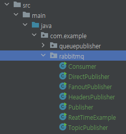

# RabbitMQ Study

## install
* https://www.rabbitmq.com/download.html
* docker run -it --rm --name rabbitmq -p 5672:5672 -p 15672:15672 rabbitmq:3.11-management

## tutorial
* https://www.rabbitmq.com/tutorials/amqp-concepts.html

### Section
* sample code
  * 
* [Direct-Exchange.md](01.%20Direct-Exchange.md)
* [Fanout-Exchange.md](02.%20Fanout-Exchange.md)
* [Topic-Exchange.md](03.%20Topic-Exchange.md)
* [Header-Exchange.md](04.%20Header-Exchange.md)

### Spring boot Section
* [rabbitmq-with-springboot.md](05.%20rabbitmq-with-springboot.md)
* com.example.queuepublisher.RabbitMqApplication

